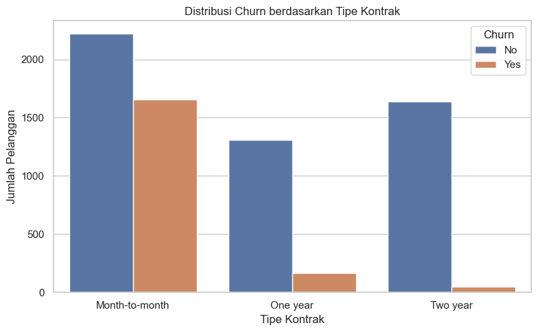
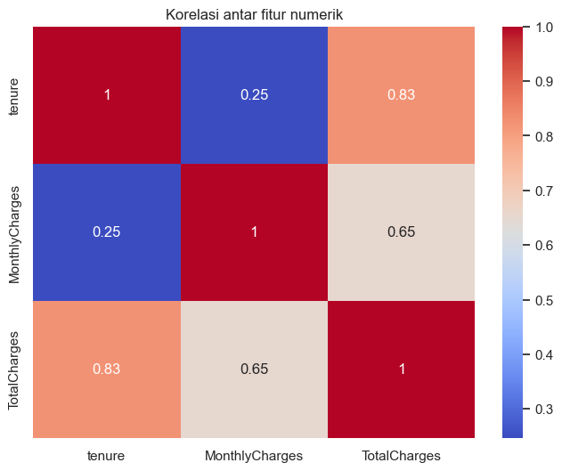
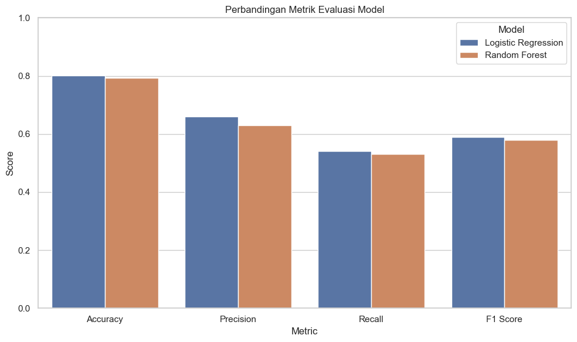
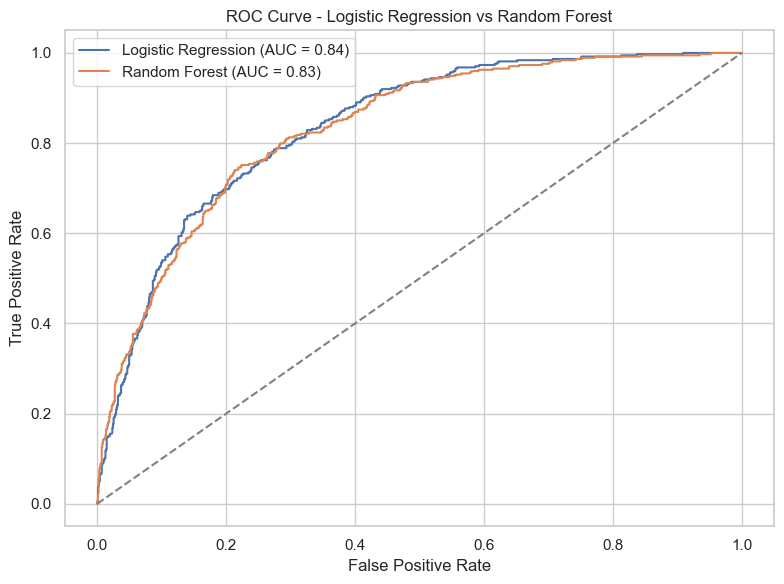

# ML Terapan Proyek 1 | Customer Churn Prediction in Telecommunication Services

###### Disusun oleh : Yoga Samudra

Ini adalah proyek pertama analisis prediktif untuk memenuhi submission Dicoding Kelas Machine Learning Terapan.

Proyek ini membangun model *machine learning* yang dapat memprediksi churn pelanggan pada layanan telekomunikasi.

## Domain Proyek

### Latar Belakang

Domain proyek *Customer Churn Prediction in Telecommunication Services* berada pada industri layanan telekomunikasi, sebuah sektor yang sangat kompetitif dan terus berkembang. Perusahaan telekomunikasi menyediakan berbagai layanan komunikasi seperti internet, telepon, dan televisi berlangganan kepada jutaan pelanggan.

Dalam domain ini, mempertahankan pelanggan lama menjadi tantangan utama karena biaya akuisisi pelanggan baru jauh lebih tinggi dibandingkan dengan mempertahankan pelanggan yang sudah ada. Salah satu indikator penting dalam manajemen pelanggan adalah churn, yaitu kondisi ketika pelanggan berhenti menggunakan layanan dan berpindah ke kompetitor.

Relevansi proyek ini dengan industri telekomunikasi adalah sebagai berikut:

1. Prediksi Churn Secara Akurat: Model prediktif yang dikembangkan dalam proyek ini bertujuan untuk membantu perusahaan telekomunikasi mengidentifikasi pelanggan yang berisiko tinggi untuk churn. Dengan menganalisis data historis pelanggan seperti masa berlangganan, jenis layanan yang digunakan, pola pembayaran, dan keluhan layanan, model ini dapat memprediksi churn secara lebih akurat.

2. Peningkatan Loyalitas dan Retensi Pelanggan: Dengan mengetahui pelanggan yang berpotensi churn, perusahaan dapat melakukan tindakan preventif seperti penawaran khusus, peningkatan layanan, atau program loyalitas. Hal ini memungkinkan peningkatan retensi pelanggan dan mencegah kehilangan pendapatan jangka panjang.

Manfaat bagi Perusahaan Telekomunikasi:
- Efisiensi Strategi Retensi: Dengan memanfaatkan prediksi churn, perusahaan dapat mengalokasikan sumber daya secara lebih efektif untuk mempertahankan pelanggan bernilai tinggi, sehingga meningkatkan efisiensi program loyalitas.
- Pengambilan Keputusan Berbasis Data: Keputusan bisnis dalam hal intervensi pelanggan menjadi lebih terarah karena didasarkan pada analisis dan skor risiko churn yang dihasilkan oleh model.

Manfaat bagi Pelanggan:
- Layanan yang Lebih Personal dan Relevan: Pelanggan yang berisiko churn akan menerima pendekatan layanan yang lebih sesuai dengan kebutuhan mereka, misalnya berupa paket khusus, peningkatan layanan, atau insentif loyalitas.
- Pengalaman Pelanggan yang Lebih Baik: Dengan adanya prediksi dan intervensi dini, pelanggan akan merasa lebih dihargai dan dipedulikan, yang dapat meningkatkan kepuasan dan loyalitas jangka panjang.

Secara keseluruhan, model analisis prediktif dalam proyek *Customer Churn Prediction in Telecommunication Services* memberikan manfaat strategis bagi perusahaan dan pelanggan. Dengan kemampuan prediksi yang akurat, perusahaan dapat mengurangi tingkat churn, mempertahankan pendapatan, serta memberikan pengalaman pelanggan yang lebih baik dan lebih personal.

## Business Understanding

### **Problem Statements**

Dalam industri telekomunikasi, kehilangan pelanggan (customer churn) berdampak langsung terhadap pendapatan dan keberlanjutan bisnis. Oleh karena itu, memahami dan memprediksi perilaku churn sangat penting. Beberapa pernyataan masalah yang diangkat dalam proyek ini adalah:

1. **Bagaimana cara mengidentifikasi pelanggan yang berpotensi untuk berhenti berlangganan layanan telekomunikasi?**
2. **Faktor apa saja yang paling memengaruhi keputusan pelanggan untuk berhenti menggunakan layanan?**
3. **Bagaimana perusahaan dapat menggunakan hasil prediksi churn untuk merancang strategi retensi pelanggan yang lebih efektif?**

### **Goals**

Berdasarkan pernyataan masalah di atas, proyek ini bertujuan untuk:

1. **Mengembangkan model machine learning yang mampu memprediksi churn pelanggan dengan akurasi tinggi.**
2. **Mengidentifikasi fitur-fitur penting yang memengaruhi churn, seperti jenis kontrak, penggunaan layanan, dan metode pembayaran.**
3. **Memberikan rekomendasi berbasis data yang dapat digunakan oleh perusahaan untuk merancang intervensi preventif terhadap pelanggan yang berisiko churn.**

### **Solution Statements**

Untuk mencapai tujuan di atas, solusi yang dirancang dalam proyek ini mencakup:

* **Penggunaan dua model machine learning:**

  * **Logistic Regression** sebagai baseline model karena interpretabilitas dan kesederhanaannya.
  * **Random Forest Classifier** untuk menangkap hubungan non-linear dan interaksi antar fitur, serta memberikan feature importance.

* **Evaluasi model menggunakan metrik klasifikasi** seperti:

  * Akurasi
  * Precision
  * Recall
  * F1-Score

* **Peningkatan performa model melalui proses tuning hyperparameter** pada model Random Forest untuk mencapai hasil yang optimal.

Dengan pendekatan ini, solusi prediktif yang dikembangkan dapat memberikan wawasan yang jelas bagi manajemen dalam mengambil keputusan retensi pelanggan berdasarkan probabilitas churn.

## **Data Understanding**

Tahap Data Understanding bertujuan untuk memahami karakteristik data pelanggan Telco sebelum membangun model prediksi churn. Dataset berisi 7043 entri pelanggan dengan 21 fitur, yang terdiri dari data demografis, layanan yang digunakan, dan informasi pembayaran.

Berikut uraian dari masing-masing fitur (kolom) di dalam dataset *Telco Customer Churn*:

1. **customerID**
   ID unik yang diberikan untuk setiap pelanggan.

2. **gender**
   Jenis kelamin pelanggan: `Male` atau `Female`.

3. **SeniorCitizen**
   Menunjukkan apakah pelanggan adalah warga senior (usia 65 tahun ke atas):
   `1` jika ya, `0` jika tidak.

4. **Partner**
   Menunjukkan apakah pelanggan memiliki pasangan:
   `Yes` atau `No`.

5. **Dependents**
   Menunjukkan apakah pelanggan memiliki tanggungan (anak atau orang lain):
   `Yes` atau `No`.

6. **tenure**
   Lama waktu pelanggan telah menggunakan layanan (dalam bulan).

7. **PhoneService**
   Menunjukkan apakah pelanggan berlangganan layanan telepon rumah:
   `Yes` atau `No`.

8. **MultipleLines**
   Menunjukkan apakah pelanggan memiliki lebih dari satu saluran telepon:

   * `No` (tidak ada layanan telepon)
   * `No phone service`
   * `Yes` (memiliki beberapa saluran)

9. **InternetService**
   Jenis layanan internet yang digunakan pelanggan:

   * `DSL`
   * `Fiber optic`
   * `No` (tidak memiliki layanan internet)

10. **OnlineSecurity**
    Apakah pelanggan memiliki perlindungan keamanan online:

    * `Yes`
    * `No`
    * `No internet service`

11. **OnlineBackup**
    Apakah pelanggan menggunakan layanan pencadangan data secara online:

    * `Yes`
    * `No`
    * `No internet service`

12. **DeviceProtection**
    Apakah pelanggan menggunakan layanan perlindungan perangkat:

    * `Yes`
    * `No`
    * `No internet service`

13. **TechSupport**
    Apakah pelanggan menggunakan layanan dukungan teknis:

    * `Yes`
    * `No`
    * `No internet service`

14. **StreamingTV**
    Apakah pelanggan berlangganan layanan streaming TV:

    * `Yes`
    * `No`
    * `No internet service`

15. **StreamingMovies**
    Apakah pelanggan berlangganan layanan streaming film:

    * `Yes`
    * `No`
    * `No internet service`

16. **Contract**
    Jenis kontrak layanan pelanggan:

    * `Month-to-month` (bulanan)
    * `One year` (satu tahun)
    * `Two year` (dua tahun)

17. **PaperlessBilling**
    Apakah pelanggan menggunakan tagihan tanpa kertas (paperless):
    `Yes` atau `No`.

18. **PaymentMethod**
    Metode pembayaran yang digunakan pelanggan:

    * `Electronic check`
    * `Mailed check`
    * `Bank transfer (automatic)`
    * `Credit card (automatic)`

19. **MonthlyCharges**
    Jumlah biaya bulanan yang dibayarkan pelanggan.

20. **TotalCharges**
    Total biaya yang telah dibayarkan oleh pelanggan selama menggunakan layanan.

21. **Churn**
    Menunjukkan apakah pelanggan berhenti berlangganan:
    `Yes` (berhenti) atau `No` (tetap berlangganan).

---

Dalam hal ini dataset dapat diunduh di: [Kaggle: Telco Customer Churn](https://www.kaggle.com/datasets/blastchar/telco-customer-churn).

---

Untuk memahami lebih lanjut karakteristik data, dilakukan eksplorasi terhadap tipe data, nilai hilang, distribusi nilai, serta korelasi antar fitur.

### 1. **Tipe Data**

* Fitur terdiri dari:

  * **Fitur kategorikal** seperti: `gender`, `SeniorCitizen`, `Partner`, `Dependents`, `PhoneService`, `InternetService`, dll.
  * **Fitur numerik**: `tenure`, `MonthlyCharges`, `TotalCharges`.

### 2. **Pemeriksaan Nilai Hilang**

* Fitur `TotalCharges` memiliki nilai kosong dalam bentuk string spasi `" "`.

  * Setelah konversi ke numerik, ditemukan 11 nilai kosong.
  * Nilai-nilai ini dihapus karena proporsinya sangat kecil (\~0.15%).

### 3. **Deskripsi Statistik**

**Fitur Numerik (Setelah dibersihkan):**

| Fitur          | Mean    | Median  | Std     | Min   | Max     |
| -------------- | ------- | ------- | ------- | ----- | ------- |
| tenure         | 32.42   | 29      | 24.55   | 1     | 72      |
| MonthlyCharges | 64.79   | 70.35   | 30.08   | 18.25 | 118.75  |
| TotalCharges   | 2283.30 | 1397.48 | 2266.77 | 18.80 | 8684.80 |

* Pelanggan yang churn cenderung memiliki `tenure` yang lebih pendek dan `TotalCharges` yang lebih rendah dibandingkan pelanggan yang tidak churn.

### 4. **Distribusi Fitur Kategorikal**

Distribusi fitur menunjukkan bahwa mayoritas pelanggan:

* Memiliki layanan telepon (PhoneService): 90.3%
* Tidak memiliki tanggungan (Dependents): 70.1%
* Berlangganan kontrak bulanan (Month-to-month): 55.1%
* Menggunakan metode pembayaran Electronic check: 33.6%
* Memiliki koneksi internet: 78.4%

**Churn berdasarkan fitur:**

* Pelanggan tanpa pasangan atau tanggungan cenderung lebih tinggi tingkat churn-nya.
* Kontrak jangka panjang (1–2 tahun) memiliki churn yang jauh lebih rendah dibandingkan kontrak bulanan.

**Hasil visualisasi:**

> 

### 5. **Korelasi Antar Fitur Numerik**

Korelasi menunjukkan hubungan yang cukup kuat antara:

* `tenure` dan `TotalCharges`: **0.83**
* `MonthlyCharges` dan `TotalCharges`: **0.65**
* `tenure` dan `MonthlyCharges`: **0.25**

**Hasil visualisasi:**

> 

### 6. **Korelasi dengan Target (Churn)**

Korelasi terhadap variabel `Churn` (dalam bentuk numerik: 0 = No, 1 = Yes):

| Fitur          | Korelasi  |
| -------------- | --------- |
| tenure         | **-0.35** |
| MonthlyCharges | +0.19     |
| TotalCharges   | -0.20     |

* **Tenure memiliki korelasi negatif yang cukup kuat**: pelanggan dengan masa langganan lebih lama cenderung tidak churn.
* **MonthlyCharges memiliki korelasi positif**: pelanggan dengan biaya bulanan lebih tinggi cenderung churn.

### 7. **Kesimpulan Sementara**

* **Pelanggan churn biasanya baru bergabung dan membayar biaya bulanan tinggi.**
* **Jenis kontrak sangat memengaruhi churn.**
* **Korelasi numerik mendukung bahwa `tenure` dan `TotalCharges` adalah indikator penting.**

## Data Preparation

Pada tahap ini, dilakukan sejumlah proses persiapan data agar data mentah yang tersedia dapat digunakan secara efektif oleh model klasifikasi. Berikut adalah teknik dan tahapan data preparation yang telah dilakukan:

### 1. Pembersihan Nilai Kosong

* Kolom `TotalCharges` seharusnya bertipe numerik, namun memiliki beberapa nilai kosong dalam bentuk string kosong (`''`).
* Data ini dikonversi menggunakan `pd.to_numeric()` dengan `errors='coerce'`, lalu baris dengan nilai `NaN` dihapus menggunakan `dropna()`.

```python
df['TotalCharges'] = pd.to_numeric(df['TotalCharges'], errors='coerce')
df = df.dropna()
```

### 2. Konversi Variabel Target

* Kolom target `Churn` yang berisi `'Yes'` dan `'No'` dikonversi menjadi nilai numerik (`1` dan `0`) agar dapat digunakan oleh algoritma klasifikasi biner.

```python
df['Churn_numerik'] = df['Churn'].map({'No': 0, 'Yes': 1})
```

### 3. Encoding Fitur Kategorikal

* Fitur kategorikal dikonversi menjadi bentuk numerik menggunakan **one-hot encoding**.
* Pada notebook, `pd.get_dummies()` digunakan **tanpa** parameter `drop_first`, sehingga seluruh kategori direpresentasikan secara eksplisit.
* Kolom `customerID` dihapus karena merupakan ID unik yang tidak memiliki pengaruh terhadap prediksi.

```python
df_encoded = pd.get_dummies(df.drop(columns=['customerID', 'Churn']))
```

### 4. Pembagian Data

* Setelah encoding dan seleksi fitur, dataset dibagi menjadi data latih (`train`) dan data uji (`test`) menggunakan `train_test_split` dengan rasio 80:20.
* Stratifikasi dilakukan berdasarkan target `Churn_numerik` agar distribusi kelas seimbang di kedua set.

```python
from sklearn.model_selection import train_test_split

X = df_encoded.drop(columns='Churn_numerik')
y = df_encoded['Churn_numerik']

X_train, X_test, y_train, y_test = train_test_split(
    X, y, test_size=0.2, random_state=42, stratify=y
)
```

### 5. Normalisasi Fitur Numerik (hanya untuk model Logistic Regression)

* **Normalisasi (scaling)** hanya diterapkan saat melatih model **Logistic Regression**, dan **hanya pada data training**, menggunakan `StandardScaler`.
* Hal ini dilakukan **setelah** pembagian data, untuk menghindari data leakage dari test set ke dalam model.

```python
from sklearn.preprocessing import StandardScaler

scaler = StandardScaler()
X_train_scaled = X_train.copy()
X_test_scaled = X_test.copy()

X_train_scaled[numerical_cols] = scaler.fit_transform(X_train[numerical_cols])
X_test_scaled[numerical_cols] = scaler.transform(X_test[numerical_cols])
```

Dengan seluruh tahapan ini, dataset telah siap digunakan untuk pelatihan model klasifikasi seperti **Logistic Regression** dan **Random Forest**.

## Modeling

Dalam proyek ini, dua algoritma machine learning dipilih untuk membangun model prediksi churn pelanggan:

1. **Logistic Regression**
2. **Random Forest Classifier**

Kedua algoritma ini dipilih karena sifatnya yang umum digunakan untuk klasifikasi biner dan memiliki kemampuan interpretabilitas serta performa yang baik pada data klasifikasi seperti churn pelanggan.

### Algoritma yang Digunakan

#### 1. Logistic Regression

* **Konsep**: Model statistik yang digunakan untuk prediksi probabilitas kejadian suatu peristiwa (binary classification). Menggunakan fungsi logit untuk menghitung hubungan antara input dan output.
* **Kelebihan**:

  * Cepat dan efisien pada dataset dengan jumlah fitur moderat.
  * Memberikan interpretasi koefisien yang jelas (arah dan kekuatan pengaruh).
* **Kekurangan**:

  * Cenderung underfit jika data bersifat kompleks atau non-linear.

#### 2. Random Forest Classifier

* **Konsep**: Model ensemble berbasis decision tree yang menggunakan teknik bagging untuk membangun beberapa pohon keputusan dan menggabungkannya untuk hasil akhir.
* **Kelebihan**:

  * Lebih tahan terhadap overfitting dibandingkan single decision tree.
  * Dapat menangani fitur non-linear dan interaksi antar fitur dengan baik.
* **Kekurangan**:

  * Interpretasi model sulit dilakukan karena kompleksitasnya.
  * Waktu komputasi bisa lebih lama dibanding Logistic Regression.

### Langkah Modeling yang Dilakukan

1. **Menentukan fitur dan target**

   * Fitur (`X`) dipilih dengan menghapus kolom `customerID`, `Churn`, dan `Churn_numerik`.
   * Target (`y`) menggunakan kolom `Churn_numerik`.

2. **Encoding fitur kategorikal**

   * Dilakukan dengan metode One-Hot Encoding menggunakan `pd.get_dummies()`.

3. **Split data**

   * Data dibagi ke dalam training dan testing dengan rasio 80:20 menggunakan `train_test_split` dan stratifikasi target.

4. **Training awal**

   * Melatih kedua model dengan parameter default.
   * Mengevaluasi performa awal dengan `accuracy_score`, `classification_report`, dan `confusion_matrix`.

5. **Tuning Hyperparameter**

   * Logistic Regression:

     * Grid Search pada parameter `C`, `penalty`, dan `solver`.
     * Param terbaik: `{'C': 0.01, 'penalty': 'l2', 'solver': 'lbfgs'}`.
   * Random Forest:

     * Grid Search pada parameter `n_estimators`, `max_depth`, `min_samples_split`, dan `min_samples_leaf`.
     * Param terbaik: `{'max_depth': 10, 'min_samples_leaf': 2, 'min_samples_split': 2, 'n_estimators': 200}`.

### Hasil Model Awal

**Logistic Regression**

* Akurasi awal: **0.8038**
* Recall kelas churn (1): **0.57**

**Random Forest**

* Akurasi awal: **0.7903**
* Recall kelas churn (1): **0.49**

### Hasil Setelah Tuning

**Tuned Logistic Regression**

* Akurasi: **0.8024**
* Recall churn: **0.54**
* Confusion Matrix:

  ```
  [[927 106]
   [172 202]]
  ```

**Tuned Random Forest**

* Akurasi: **0.7932**
* Recall churn: **0.53**
* Confusion Matrix:

  ```
  [[919 114]
   [177 197]]
  ```

### Pemilihan Model Terbaik

Meskipun kedua model memiliki akurasi yang cukup baik dan relatif seimbang, **Logistic Regression dengan tuning** dipilih sebagai model utama karena:

* Memiliki akurasi sedikit lebih tinggi
* Recall pada kelas churn sedikit lebih tinggi
* Model lebih sederhana dan interpretatif
* Lebih cepat dalam pelatihan dan prediksi

## Evaluation

Dalam proyek ini, permasalahan yang dihadapi adalah **klasifikasi biner** untuk memprediksi apakah seorang pelanggan akan melakukan churn (berhenti menggunakan layanan) atau tidak. Oleh karena itu, metrik evaluasi yang digunakan harus mampu menangkap keseimbangan performa prediksi antara dua kelas: **churn (1)** dan **tidak churn (0)**.


### Metrik Evaluasi yang Digunakan

1. **Accuracy**

   * Mengukur proporsi prediksi yang benar dari seluruh data.
   * Cocok digunakan saat distribusi kelas seimbang, tetapi **tidak cukup** jika kelas tidak seimbang.

2. **Precision**

   * Proporsi prediksi churn yang benar dari seluruh prediksi churn.
   * Penting jika **false positive** harus diminimalkan (misalnya menghindari menawarkan promo ke pelanggan yang tidak akan churn).

3. **Recall**

   * Proporsi churn yang berhasil diprediksi dari seluruh kasus churn aktual.
   * Penting untuk **mendeteksi sebanyak mungkin pelanggan yang akan churn**, agar bisa dilakukan retensi.

4. **F1 Score**

   * Harmonic mean dari precision dan recall. Memberikan keseimbangan antara keduanya.
   * Sangat berguna saat terdapat ketidakseimbangan antar kelas dan kita ingin optimasi antara precision dan recall.

5. **Confusion Matrix**

   * Menunjukkan performa klasifikasi secara langsung dalam bentuk True/False Positive dan Negative.


### Hasil Evaluasi

#### 1. **Logistic Regression (Setelah Tuning)**

* **Accuracy**: 0.802
* **Precision (Churn)**: 0.66
* **Recall (Churn)**: 0.54
* **F1-Score (Churn)**: 0.59
* **Confusion Matrix**:

  ```
  [[927 106]
   [172 202]]
  ```

#### 2. **Random Forest (Setelah Tuning)**

* **Accuracy**: 0.793
* **Precision (Churn)**: 0.63
* **Recall (Churn)**: 0.53
* **F1-Score (Churn)**: 0.58
* **Confusion Matrix**:

  ```
  [[919 114]
   [177 197]]
  ```

> ### Visualisasi Evaluasi Model
>
> Untuk memperjelas performa masing-masing model, berikut visualisasi metrik evaluasi utama:
>
> * Gambar 1: Perbandingan Accuracy, Precision, Recall, dan F1 Score.
> 

> * Gambar 2: Kurva ROC dan nilai AUC dari kedua model.
> 

> Model Logistic Regression menunjukkan AUC sedikit lebih tinggi, menandakan kemampuannya dalam membedakan antara kelas churn dan tidak churn sedikit lebih baik dibanding Random Forest.

### Interpretasi Hasil

* **Akurasi** kedua model cukup baik (>79%), namun ini **bukan satu-satunya indikator utama**, karena kita fokus pada kelas minoritas: **Churn (1)**.
* **Recall** yang tidak terlalu tinggi (\~54%) menunjukkan bahwa masih banyak pelanggan yang benar-benar churn namun gagal terdeteksi. Ini adalah area untuk perbaikan di masa depan (misal: balancing data, model yang lebih kompleks, atau feature engineering tambahan).
* **Precision** di atas 0.60 menandakan model tidak terlalu sering salah dalam memprediksi churn (false positives masih cukup terkendali).
* **F1 Score** \~0.59 menandakan trade-off yang lumayan stabil antara precision dan recall.

### Kesimpulan Evaluasi

Model Logistic Regression yang telah dituning memberikan hasil yang **sedikit lebih baik** dibandingkan Random Forest, terutama dalam hal recall dan interpretabilitas. Oleh karena itu, model ini dipilih sebagai model akhir untuk digunakan pada tahap berikutnya dalam pengambilan keputusan bisnis.

Berikut adalah **draft bagian *Kesimpulan*** yang telah disesuaikan dengan struktur laporan Dicoding, konteks proyek prediksi *Customer Churn*, dan gaya penulisan formal seperti pada contoh yang kamu berikan:

## Kesimpulan

Proyek ini berhasil mengembangkan dua model klasifikasi — **Logistic Regression** dan **Random Forest** — untuk memprediksi pelanggan yang berpotensi melakukan churn pada layanan telekomunikasi.

Hasil evaluasi menunjukkan bahwa model **Logistic Regression** memberikan performa terbaik berdasarkan nilai akurasi dan AUC, dengan **akurasi sebesar 80.2%** dan mampu menangkap pola churn dengan keseimbangan precision dan recall yang lebih stabil dibandingkan model Random Forest.

Model Logistic Regression dengan regularisasi L2 dan parameter `C=0.01` terbukti efektif dalam mencegah overfitting serta menangani fitur-fitur dummy dari data kategorikal. Sedangkan model Random Forest meskipun kompetitif, memiliki recall lebih rendah pada kelas churn, yang penting dalam konteks prediksi pelanggan berhenti langganan.

### Manfaat Bagi Perusahaan Telekomunikasi

**1. Deteksi Dini Pelanggan Berisiko Churn**
Model yang dikembangkan dapat membantu perusahaan mengidentifikasi pelanggan yang berisiko churn lebih awal sehingga memungkinkan tim layanan pelanggan mengambil tindakan preventif seperti penawaran personalisasi atau diskon.

**2. Optimalisasi Strategi Retensi**
Dengan memahami karakteristik pelanggan yang berisiko churn (berdasarkan fitur penting yang dianalisis), perusahaan dapat merancang strategi retensi berbasis data, mengalokasikan sumber daya secara lebih efisien.

**3. Pengambilan Keputusan Berbasis Data**
Implementasi model klasifikasi ini mendorong penggunaan pendekatan berbasis data (*data-driven decision making*) dalam pengelolaan pelanggan, yang dapat meningkatkan profitabilitas dan loyalitas pelanggan.

### Langkah Tindak Lanjut

**1. Integrasi Model ke Sistem Operasional**
Model Logistic Regression yang telah dikembangkan dapat diintegrasikan ke dalam sistem CRM atau dashboard analitik untuk memantau pelanggan secara real-time.

**2. Penambahan Fitur Baru & Sumber Data Tambahan**
Untuk meningkatkan akurasi prediksi, perusahaan dapat mempertimbangkan fitur tambahan seperti aktivitas pelanggan, interaksi dengan layanan pelanggan, atau data historis promosi.

**3. Pembaruan Model Berkala**
Model perlu diperbarui secara berkala dengan data terbaru agar tetap relevan terhadap perubahan perilaku pelanggan dan dinamika pasar.

**4. Eksplorasi Teknik Lanjutan**
Ke depan, perusahaan dapat mengeksplorasi teknik machine learning yang lebih kompleks seperti Gradient Boosting atau XGBoost, serta menerapkan metode explainability seperti SHAP untuk interpretabilitas model.


Dengan implementasi yang tepat, model prediksi churn ini dapat menjadi alat penting dalam meningkatkan kepuasan pelanggan, menekan angka churn, dan menjaga keunggulan kompetitif perusahaan di industri telekomunikasi.